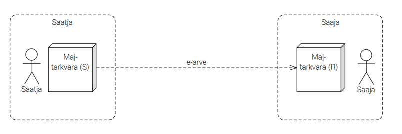
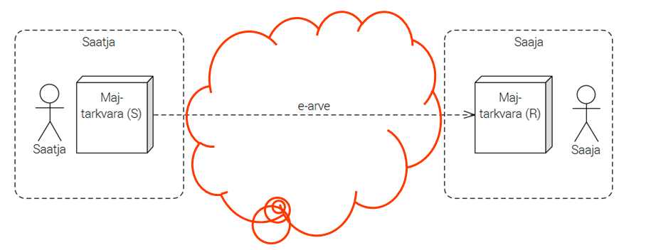
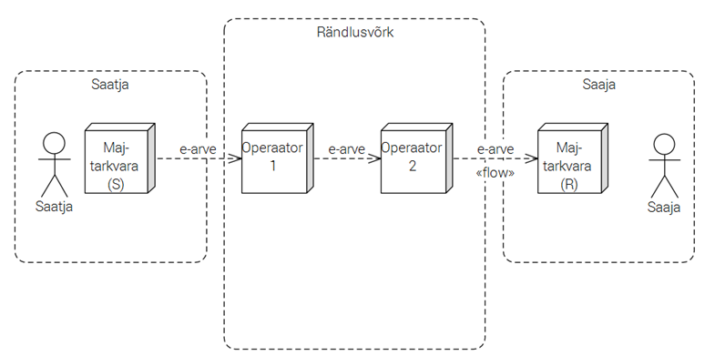
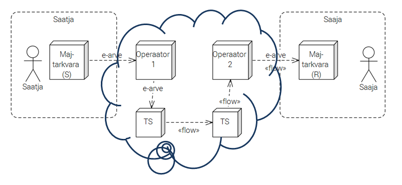

# E-arvete liikluse võimalik tulevikuarhitektuur

Priit Parmakson, RIA

ettekanne e-arvete töörühmas 18.01.2016

## Probleem

## Andmeedastuse nõuded

- *authenticity* – kindlus, et arve tuleb õigelt isikult
- *integrity* – õigel kujul
- *reliability* – jõuab kindlasti kohale
- *deliverability* – adressaat on leitav (arve kättetoimetatav)

## Mida on selleks vaja?

- 200 000+ arveid käitlevat osapoolt
- bilateraalsed (kahepoolsed) liidestused -> iga liidestus eriline -> €€€€€; multilateraalsed liidestused -> standarditud -> €
- operatoorite rändlusvõrk – ka 4-5 osaleja puhul bilateraalsed liidestused -> €€€€€

## X-tee

aadressid: `70002093` Kadrioru lasteaed
dokumentide vastuvõtupunktid: `EE/GOV/70003158/DHS/sendDocument`

Uus dokumendivahetusprotokoll DHX

RIA 2016. a tööplaanis

GitHub-is: [https://github.com/e-gov/DHX/]()

