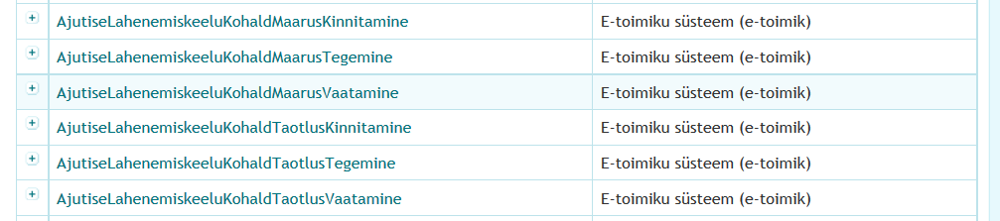
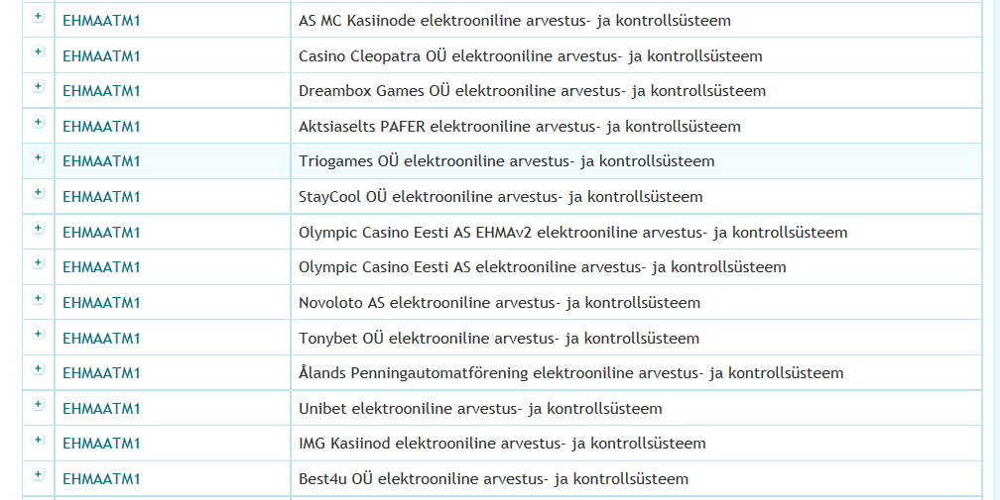
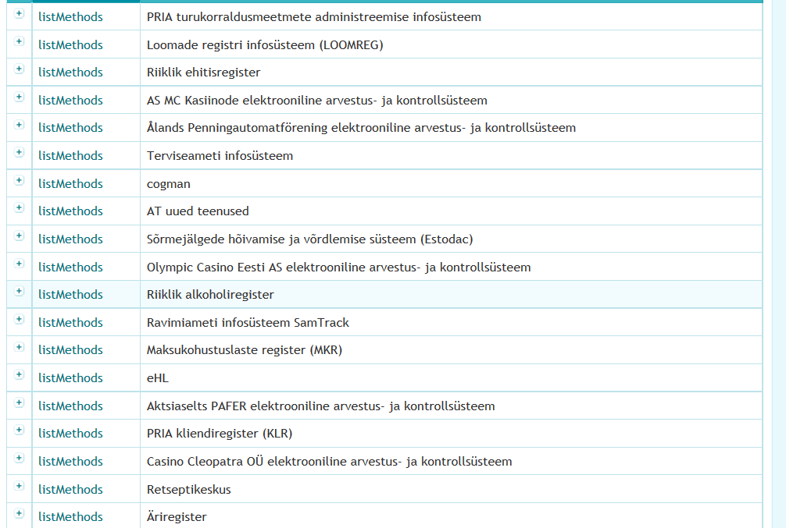
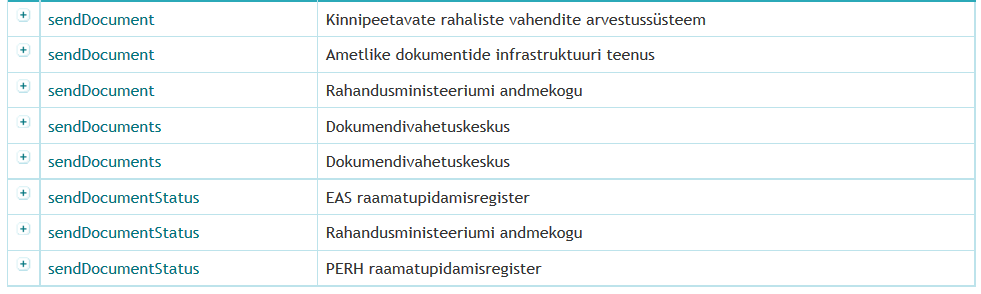

## Testi kui hea mustrituvastaja oled

Siin on 7 pildistust X-tee teenuste kataloogist (teenuse nimi, teenust pakkuv andmekogu) ([RIHA](https://riha.eesti.ee)).

1) Kas tajud teenusenimedes korrapära? Tuvasta nimemuster.

2) Milline sügavam, infotöötluslik või isegi äriline sisu võiks seista iga nimemustri taga?

##1

##2

##3

##4

##5

##6

---
[Vastused](VASTUSED.md)
