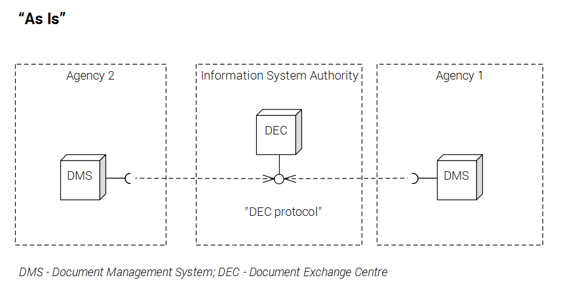
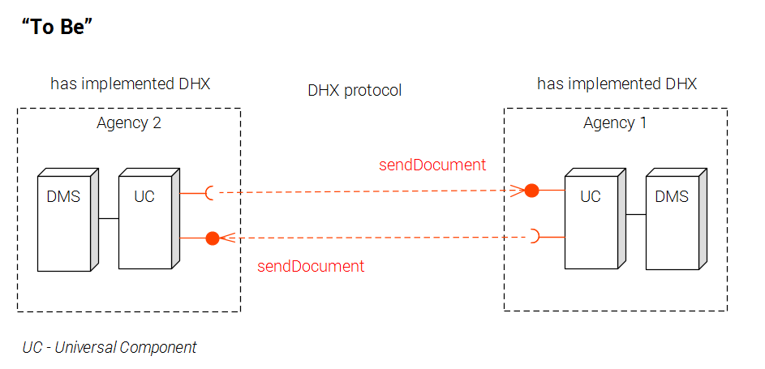
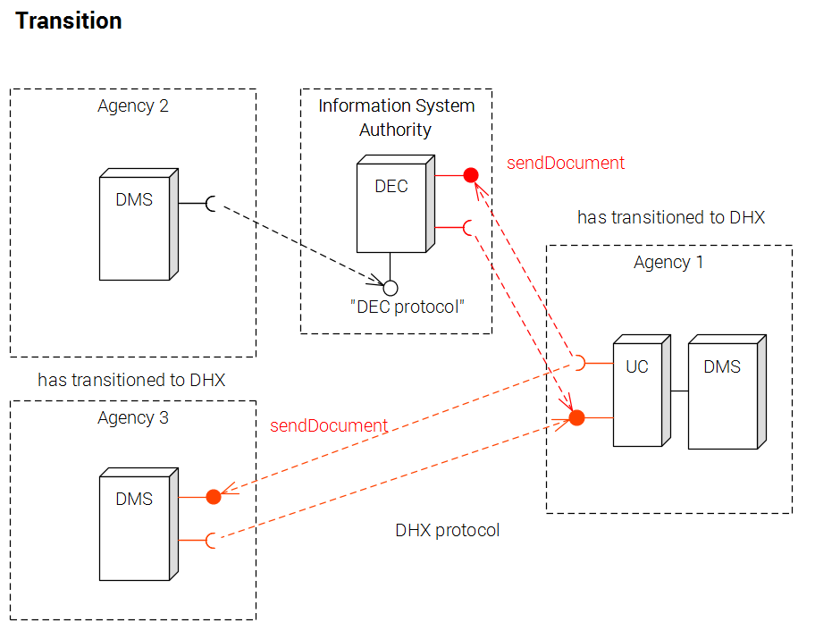
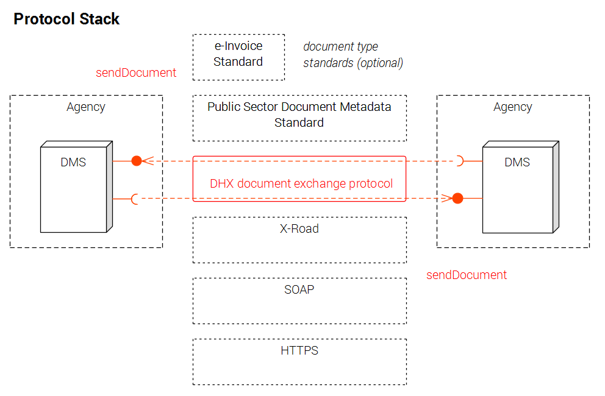

# Document exchange protocol DHX

Developed by Estonian Information System Agency 2015-2016

### Purpose
* standardised and simple method to exchange documents

### Target group
* all Estonian public sector organisations (mandatory)
* companies who have a lot of business with public sector (optional)

### Motivation
* faster and simpler document ecxhange
* lower operating costs
* no Single Point of Failure

### Architecture
* from centralised to distributed model

 

 

 

### Builds on unique capabilities of X-Road

X-Road, the Estonian national public sector data exchange layer, solves:
* addressability
* service discovery
* identity
* security
* legal

### Elements of DHX
* DHX web service
* naming rule
* message format: Estonian Document Metadata Standard ("the Capsule")
* processing rules

### Schedule
* 2015 - Draft version of the protocol
* 2016 - Reference implementation, verification, development of universal adapter component, migration planning
* 2017-2018 - Migration to DHX
