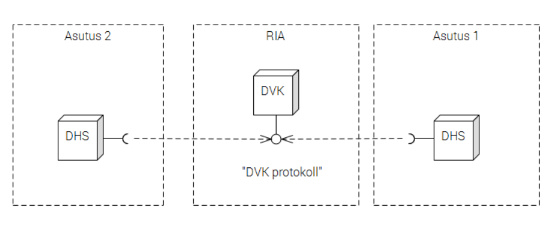
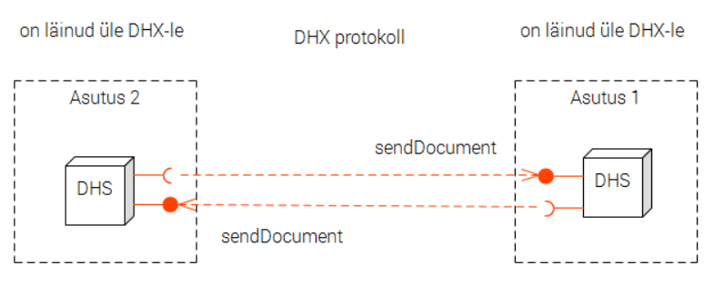
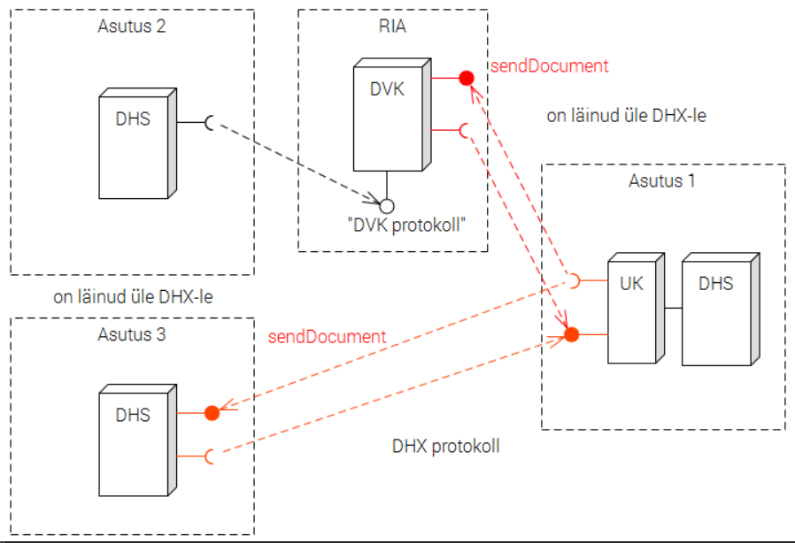

###  Dokumendivahetusprotokoll DHX

Riigi Infosüsteemi Amet

v 0.6

#### Sisukord

[1 Ülevaade](Protokoll.md#%C3%9Clevaade)

[2 Nõuete keel](Protokoll.md#n%C3%B5uete-keel)

[3 Mõisted ja lühendid](Protokoll.md#m%C3%B5isted-ja-l%C3%BChendid)

[4 Lähteolukord](Protokoll.md#l%C3%A4hteolukord)

[5 DHX teenus](Protokoll.md#dhx-teenus)

[6 Vahendamine](Protokoll.md#vahendamine)

[7 Vahendusnimekiri](Protokoll.md#vahendusnimekiri)

[8 Vahendajate nimekiri](Protokoll.md#vahendajate-nimekiri)

[9 Saatmine](Protokoll.md#saatmine)

[10 Vastuvõtmine](Protokoll.md#vastuvõtmine)

  - [10.1 Aadressi kontroll](Protokoll.md#101-aadressi-kontroll)

  - [10.2 Valest aadressist teatamine](Protokoll.md#102-valest-aadressist-teatamine)

  - [10.3 Kapsli kontroll](Protokoll.md#103-kapsli-kontroll)

  - [10.4 Mitme aadressi käsitlus](Protokoll.md#104-mitme-aadressi-käsitlus)

  - [10.5 Vastuvõtmine DVK-lt](Protokoll.md#105-vastuvõtmine-dvk-lt)

[11 Üleminek](Protokoll.md#%C3%9Cleminek)

[12 DVK toimimine üleminekuperioodil](Protokoll.md#dvk-toimimine-%C3%BCleminekuperioodil)

[Viited](Protokoll.md#viited)

[Lisa 1. DHX teenuse spetsifikatsioon](Protokoll.md#lisa-1-dhx-teenuse-spetsifikatsioon)

[Lisa 2. Vahendusnimekirja teenuse spetsifikatsioon](Protokoll.md#lisa-2-vahendusnimekirja-teenuse-spetsifikatsioon)

Joonised:
 - Joonis 1. [Lähteolukord: dokumendivahetus DVK kaudu](Protokoll.md#l%C3%A4hteolukord)
 - Joonis 2. [DHX põhiskeem](Protokoll.md#dhx-teenus)
 - Joonis 3. [DHX dokumendivahetusteenuse vahendamine](Protokoll.md#vahendamine)
 - Joonis 4. [Vahendajate nimekiri](Protokoll.md#vahendajate-nimekiri)
 - Joonis 5  [Toimimine üleminekuperioodil](Protokoll.md#%C3%9Cleminek) 

####  1 Ülevaade

1. Dokumendivahetusprotokoll DHX on standardiseeritud tehniline ja organisatsiooniline lahendus, mis võimaldab asutustel vahetada dokumente hajus- e detsentraliseeritud põhimõttel.

2. DHX kasutab X-tee taristut. Erinevalt vanemast Dokumendivahetuskeskusest (DVK) ei nõua DHX dokumendihaldussüsteemidelt (DHS) enam "postkontoris" posti järel käimist, vaid dokumendid liiguvad otse saatjalt saajale.

3. DHX on mõeldud eelkõige avaliku sektori dokumendivahetuse turvaliseks ja kuluefektiivseks korraldamiseks, kuid skeem on laiendatav ka era- ja vabasektori organisatsioonidele.

4. DHX toetab andmeteenuse vahendamist (X-tee mõistes).

5. DHX võimaldab elektroonilist dokumendivahetust korraldada detsentraliseeritult, ilma keskse postitöötlemissõlmeta. Protokoll ei nõua individuaalseid (bilateraalseid) kokkuleppeid, häälestusi, liideste ehitamist vms dokumente vahetavate asutuste vahel. Protokolli järgiv asutus saab teisele asutusele saata dokumendi ilma mingi varasema kontaktita kahe asutuse vahel.

6. Käesolev dokument määratleb nõuded, andmevormingud, töötlus- ja menetlusloogikad kõigile osapooltele - DHX-i rakendavatele asutustele, DHX-i vahendajatele ja X-tee keskusele. Samuti käsitletakse üleminekut seni DVK kaudu korraldatud dokumendivahetuselt DHX-i kasutamisele.

7. Protokolli koostamisel on aluseks protokollide spetsifitseerimise parim praktika [RIA-PP].

8. Protokolli on välja töötanud Riigi Infosüsteemi Amet. Ettepanekud ja märkused saata help@ria.ee või luua käesolevas varamus `Issue`.

#### 2 Nõuete keel

1. Normatiivse tähendusega on käesolev tekst. GitHub-i varamu muul sisul on informatiivne tähendus.

2. Läbiva suurtähega esitatud sõnu tuleb tõlgendada järgmiselt (vrdl [RFC 2119]):
 - "PEAB", "TOHIB AINULT" - protokolli implementeerija ei saa deklareerida protokollile vastavust, kui nõue on täitmata.
 - "PEAKS" - nõue ei pea tingimata olema implementeeritud, kuidimplementatsiooni saab lugeda protokollile vastavaks ainult siis, kui nõude täitmisest kõrvalekaldumiseks on kaalukas põhjus.
 - "VÕIB" - omadust võib implementeerida; mitteimplementeerimist ei pea põhjendama.

#### 3 Mõisted ja lühendid

| | |
|---|---|
| _adressaat_ | asutus, kellele tahetakse dokumenti saata. Adressaadi määrab üheselt asutuse registrikood. |
| _asutus_ | DHX dokumendivahetuses osalev organisatsioon. Eelkõige Eesti avaliku sektori asutus, aga võib olla ka ettevõte või vabasektori organisatsioon. Asutuselt eeldatakse ametlikku registrisse (riigi ja kohaliku omavalitsuse asutuste riiklik register (RKOARR), äriregister, mittetulundusasutuste register) kantust ja registrikoodi olemasolu. |
| _DHX dokumendivahetus_ | dokumentide vahetus X-teel vastavalt DHX protokollile. |
| _DHX otserakendaja_ | DHX-i otse, st ilma vahendajata rakendav (kasutav) asutus. |
| _DHX otsevõimekus_ | DHX-i rakendamine (e kasutamine) ilma vahendajata. |
| _DHX-i rakendaja_ | asutus, kes kasutab DHX-i |
| _DHX teenus_ | standarditud nimemustriga `EE/GOV/<registrikood>/DHX/sendDocument` X-tee teenus, mille kaudu DHX-i otserakendaja ja või vahendaja võtavad vastu dokumente. |
| _DHX vahendamine_ | X-tee kasutusmuster kus vahendaja rollis tegutsev X-tee liige (DHX vahendaja) võimaldab oma infosüsteemi vahendusel asutuse juurdepääsu DHX dokumendivahetusele. Vt DHX otserakendamine. |
| _DHX vahendaja_, pikemalt _DHX dokumendivahetusteenuse vahendaja_, lühidalt lihtsalt _vahendaja_ | X-tee liige, kes osutab asutusele teenust, vahendades DHX dokumendiedastust. Tüüpiliselt DHS-i pilve- või majutusteenuse osutaja; võib olla nii erasektori teenuseosutaja kui ka avaliku sektori asutus, kes osutab teenust teisele asutusele. |
| _DHX vahendajate grupp_ | tehniline abinõu DHX vahendajate nimekirja pidamiseks. DHX vahendajate grupp on osa X-tee globaalsest konfiguratsioonist. |
| _DHX vahendajate nimekiri_ | X-tee keskuse (RIA) poolt peetav nimekiri DHX dokumendivahetusteenuse vahendajatest. |
| _DHX võimekus vahendaja kaudu_ | DHX-i kasutamine läbi vahendaja. Vt DHX otsekasutus. |
| _DHX võimekus_ | DHS-i võimekus saata ja vastu võtta dokumente vastavalt DHX protokollile. DHX võimekuse võib teostada kas otse (vt DHX otsevõimekus) või läbi vahendaja (vt DHX võimekus vahendaja kaudu). |
| _DHS pilveteenusena_ | suhe, kus üks organisatsioon (ettevõte või teine asutus) pakub asutusele DHS-i tehnilist keskkonda. Ühes tehnilises keskkonnas võib olla mitu "virtuaalset" DHS-i. Näiteks Majandus- ja Kommunikatsiooniministeerium pakub DHS-i teenust ministeeriumi haldusala asutustele; Koolide infosüsteem KIS pakub DHS-i teenust reale lasteaedadele. DHS pilveteenusena ja DHX vahendamine võivad olla ühitatud, kuid on siiski erinevad mõisted. Majutaja ei pea alati olema vahendaja. Vahendussuhe on siis, kui X-tee liiklus käib vahendaja sertifikaadiga. |
| _dokument_ | asutuses töödeldav dokument Eesti avaliku sektori dokumendihalduse tähenduses. |
| _dokumendihaldussüsteem_, _DHS_ | asutuse elektroonilise dokumendihalduse, sh dokumendivahetuse teenindamisele spetsialiseerunud infosüsteem. |
| _globaalne konfiguratsioon_ | X-tee metaandmekogum, nimekiri X-tee liikmetest, alamsüsteemidest ja gruppidest. Vt [PR-GCONF], [PR-META]. |
| _DVK_ | Dokumendivahetuskeskus [DVK]. |
| _RIA_ | Riigi Infosüsteemi Amet. |
| _registrikood_ | asutuse ametlik registrikood. Nt `70002093` `Kadrioru lasteaed`. |
| _vastuvõttev süsteem_ | dokumenti X-teel DHX protokolli kohaselt vastuvõttev infosüsteem (võib olla ka vahendaja infosüsteem ja üleminekuperioodil DVK) |
| _saatev süsteem_ | dokumenti X-teel DHX protokolli kohaselt saatev infosüsteem (võib olla ka vahendaja infosüsteem) |
| _teenuse identifikaator_ | X-tee [X-tee] versiooni 6 nõuete kohane X-tee teenuse identifikaator. Identifitseerib unikaalselt X-tee teenuse nii Eesti X-teel kui ka X-tee implementatsioonide rahvusvahelises võrgus. Koosneb X-tee liikme identifikaatorist, teenuse koodnimetusest ja valikulisest versiooninumbrist. Näiteks: `EE/GOV/70003158/DHX/sendDocument`. |
| _vahendaja_ | vt DHX vahendaja|
| _vahendatav_ | asutus, kes on loonud DHX võimekuse vahendaja kaudu. DHX dokumendivahetuses X-teel oma sertifikaadiga ei osale, vaid kasutab vahendaja teenust. |
| _vahendusnimekiri_ | DHX dokumendivahendusteenuse vahendaja poolt X-teel teenusena pakutav nimekiri asutustest, keda ta vahendab. |
| _üleminekuperiood_ | Dokumendivahetuskeskuse (DVK) kasutamiselt DHX kasutamisele ülemineku periood. Perioodi alguse ja lõpu määrab X-tee keskus. |
| _X-tee keskus_ | X-tee haldaja. X-tee keskuse rolli täitab RIA. X-tee keskus peab DHX vahendajate nimekirja. |

#### 4 Lähteolukord

1. DHS-id vahetavad praegu dokumente DVK kaudu, kasutades tingliku nimetusega "DVK protokolli". "DVK protokolli" määravad elektroonilise andmevahetuse metaandmete loend [Kapsel], DVK liideste spetsifikatsioon [DVK spetsifikatsioon] ja [DVK pidamise kord], laiemas plaanis ka "Asjaajamise ühtsed alused" [AÜK]. Väiksemal arvul on dokumendivahetusliideseid loodud ka muude dokumente töötlevate infosüsteemide vahele. Need liidesed ei ole standarditud. Laienev dokumendiringlus ja dokumente vahetavate infosüsteemide tihenev võrgustik (dokumendivahetus tänapäeval ei piirdu „puhaste“ DHS-dega – dokumente vahetavad ka infosüsteemid, kus dokumendihaldus klassikalises mõttes on ainult üks andmetöötluse liik) nõuab alternatiivi ühe keskse postkastiserveri kaudu toimuvale dokumendiliiklusele.

 

 Joonis 1. Lähteolukord: dokumendivahetus DVK kaudu

#### 5 DHX teenus

1. DHX teenus on standardse nimemustri ja töötlusloogikaga X-tee teenus, millega asutus saab saata teisele asutusele dokumente.

 

 Joonis 2. DHX põhiskeem

2. DHX teenuse kasutamine on interaktsioon, mis koosneb kahest sõnumisaatmisest:
 - dokumenti saatja saadab teenusele `sendDocument` X-tee päringusõnumi (päringu)
 - dokumendi saaja saadab vastussõnumi kinnitusega dokumendi kättesaamise kohta.

3.	Dokument edastatakse päringus.

4. Iga DHX-i rakendav asutus PEAB arendama oma DHS-is välja DHX teenuse, avama selle teenuse teistele asutustele ja käitama teenust.

4. Kui asutus turvapoliitika vm kaalutlustel ei pea otstarbekaks DHX teenuse avamist kõigile X-tee liikmetele, siis VÕIB ta DHX teenuse avada konkreetsetele X-tee liikmetele (pääsuõiguste andmisega X-tee turvaserveris).

5. Üleminekuperioodiks PEAB DHX teenuse avama ka DVK-le.

 _DVK edastab dokumente asutustelt, kes ei ole veel DHX-i võimekust loonud._ 

5. "DHX" on reserveeritud nimi. DHX teenus PEAB kasutama X-tee alamsüsteemi "DHX". X-tee keskus EI TOHI registreerida ühegi asutuse alamsüsteemi "DHX" teiseks otstarbeks.

6.	DHX teenuse nimi PEAB järgima mustrit `EE/<liikmeklass>/<registrikood>/DHX/sendDocument`, kus
 - `EE` on X-tee Eesti instantsi nimi
 - `<liikmeklass>` on X-tee liikmeklass (vastavalt vahendaja õiguslikule vormile kas `GOV` või `PRI`) 
 - `DHX` on teenuse ülesleidmist tagav, käesoleva protokolliga fikseeritud X-tee alamsüsteemi nimi ja
 - `<registrikood>` on asutuse registrikood.

 Näide: `EE/GOV/70003158/DHX/sendDocument`

7. Dokumendi PEAB edastama ametlikult kinnitatud elektroonilise andmevahetuse metaandmete loendile vastavas "kapslis" [Kapsel]. Dokumendi kapslis edastatakse muuhulgas adressaadiks oleva asutuse registrikood.

8. Saatev süsteem PEAB andma dokumendile identifikaatori, mis on unikaalne vähemalt DHS-i piires.

9. DHX-i rakendaja teostatud DHX teenus PEAB vastama lisas 1 esitatud täpsemale spetsifikatsioonile.

#### 6 Vahendamine

1. Asutus VÕIB rakendada DHX-i ka vahendaja kaudu.

2. Vahendamise korral osutab dokumentide X-teel saatmise ja vastuvõtmise teenust asutusele vahendaja oma infosüsteemi kaudu. Asutus ise X-teega DHX kontekstis ei suhtle. Asutus ei pea isegi olema X-tee liige. Vahendaja esineb X-teel oma nime all. Vahendaja võib olla nii erasektori ettevõte kui ka avaliku sektori asutus.

3. DHX vahendamisel arendab DHX teenuse välja, avab teistele asutustele ja käitab teenust vahendaja.

4. Vahendamise korral kuulub DHX teenuse juurde ka vahendusnimekirja teenus.

 

 Joonis 3 DHX teenusevahendamine

 Joonisel 3 on esitatud interaktsiooni põhimõtteskeem vahendamise korral.
 
5. DHX rakendamisel läbi vahendaja PEAB asutus sõlmima lepingu DHX vahendajaga. Kasutada TOHIB AINULT X-tee keskuse poolt DHX vahendajate nimekirja lisatud vahendajaid.

6. Vahendaja PEAB X-tee teenuse vormis avalikustama vahendusnimekirja - nimekirja asutustest, keda ta esindab.

7. Vahendamisele kehtivad X-tee määrusest tulenevad nõuded: vahendajana end X-teel registreerimise kohustus, andmeteenuse vahendamise korra (poliitika) koostamise ja avalikustamise kohustus jm (vt [X-tee määrus] § 13).

#### 7 Vahendusnimekiri

1. Vahendusnimekiri on vahendaja peetav nimekiri asutustest, keda ta vahendab.

2. Iga vahendaja PEAB pidama vahendusnimekirja.

2. Vahendaja PEAB hoidma vahendusnimekirja ajakohasena. Ajakohasus tähendab seda, et vahendusnimekirjas on need ja ainult need asutused, kellega vahendajal on kehtivad vahenduslepingud.

3. Vahendaja PEAB vahendusnimekirja tegema kättesaadavaks X-tee teenusena.

2. Vahendusnimekirja teenuse nimi PEAB järgima mustrit `EE/<liikmeklass>/<registrikood>/DHX/representationList`, kus
 - `EE` on X-tee Eesti instantsi nimi
 - `<liikmeklass>` on X-tee liikmeklass (väärtus vastavalt X-tee protokollile - vastavalt vahendaja õiguslikule vormile kas `GOV`, `COM`, `NGO` või `NEE`) 
 - `DHX` on teenuse ülesleidmist tagav, käesoleva protokolliga fikseeritud X-tee alamsüsteeminimi ja
 - `<registrikood>` on asutuse registrikood.

 Näide: `EE/COM/40001111/DHX/representationList`

3. DHX-i rakendaja teostatud vahendusnimekirja teenus PEAB vastama lisas 2 esitatud täpsemale spetsifikatsioonile.

#### 8 Vahendajate nimekiri

1. Vahendajate nimekiri on nimekiri DHX dokumendivahetusteenuse vahendajatest.

2. Vahendajate nimekirja peab X-tee keskus (RIA).

3. Tehniliselt teostatakse vahendajate nimekiri DHX vahendajate grupina. DHX vahendajate grupp on osa X-tee globaalsest konfiguratsioonist. Vahendajate nimekiri on X-tee globaalse konfiguratsiooni osana avalikult kättesaadav kõigile X-tee liikmetele. 

4. Vahendajana tegutseda sooviv asutus või ettevõte PEAB end vahendajana X-teel registreerima. Registreerimise täpse korra kehtestab X-tee keskus.

5. X-tee keskus PEAB pidama DHX vahendajate nimekirja ajakohasena. 

#### 9 Saatmine

1. Saatev süsteem PEAB kontrollima, kas adressaadil on DHX võimekus. DHX võimekus võib olla otsevõimekus või võimekus vahendaja kaudu.

2. Saatev süsteem PEAKS otsevõimekust kontrollima X-tee globaalse konfiguratsioonifaili põhjal. Otsevõimekuse tunnus on DHX alamsüsteemi olemasolu asutusel. Globaalse konfiguratsiooni VÕIB alla laadida X-tee keskusest või kasutada X-tee turvaserveri poolt allalaetud, turvaserveri liidese poolt pakutud globaalset konfiguratsioonifaili.

3. Kui saatev süsteem peab DHX otsevõimekuse kontrollimist X-tee globaalse konfiguratsioonifaili põhjal tehniliselt liiga keerukaks, siis VÕIB otsevõimekust kontrollida ka otsese saatmisüritusega.
 
 _Kui turvaserver vastab, et adressaadil alamsüsteem DHX puudub, siis sellest võib järeldada, et adressaadil DHX otsevõimekus puudub._

 _Saatja turvaserver laeb perioodiliselt X-tee keskserverist alla teavet X-tee konfiguratsiooni kohta [PR-GCONF], sh teavet X-tee liikmete poolt määratletud alamsüsteemide ja turvaserverite kohta. Saatja turvaserver teeb ülalnimetatud konfiguratsiooniteabe põhjal kindlaks, kas adressaat on määratlenud DHX alamsüsteemi. Kui ei ole, siis DHX võimekus puudub._

4. Saatev süsteem VÕIB otsevõimekuse kontrolli tulemust puhverdada. Puhvri värskendamise periood PEAB olema konfigureeritav.

5. Otsevõimekuse olemasolu korral saadetakse dokument otse.

6. Otsevõimekuse puudumise korral PEAB saatev süsteem kontrollima, kas adressaadil on DHX võimekus läbi vahendaja.

7. DHX võimekuse läbi vahendaja kontrollimiseks PEAB saatev süsteem:
 - alla laadima X-tee keskusest X-tee globaalse konfiguratsiooni faili või kasutama turvaserveri poolt allalaetud globaalse konfiguratsiooni faili;
 - leidma failist vahendajate nimekirja (DHX vahendajate grupi);
 - käima kõik vahendajad läbi ning pärima X-tee kaudu vahendusnimekirjad;
 - kindlaks tegema, kas adressaat sisaldub vahendusnimekirjades.

8. DHX võimekuse läbi vahendaja kontrolli tulemusi VÕIB puhverdada. Puhvri värskendamise periood PEAB olema konfigureeritav.

9. Saatev süsteem VÕIB DHX võimekuse kontrolli tarvis ehitada nn lokaalse aadressiraamatu, ühendades p 2 ja 6 tulemused.

10. Punktides 3, 7 ja 8 nimetatud puhvrite või lokaalse aadressiraamatu värskendamise periood PEAB olema konfigureeritav.

11. Kui adressaadil puudub DHX otsevõimekus, kuid on DHX võimekus läbi vahendaja, siis PEAB saatev süsteem saatma dokumendi vahendajale.

12. Kui saatev süsteem on kindlaks teinud, et adressaadil puudub DHX võimekus ja käimas on üleminekuperiood, siis PEAB saatev süsteem üritama dokumenti saata DVK `sendDocument` teenusesse. 

 _Tegu on juhuga, kus adressaat ei ole veel DHX-i võimekust loonud. Adressaat võib olla veel DVK kasutaja. DVK saadab_ `sendDocument` _teenusesse saadetud dokumendi adressaadile edasi. Kui adressaat ei ole DVK kasutaja, siis teatab DVK_ `adressaat tundmatu`_. Saatev süsteem on kõik võimalused ammendanud ja tuleb konstateerida, et dokumenti ei saa edastada - vähemalt seni, kuni adressaat ei ole DHX võimekust loonud._

13. Dokument loetakse edastatuks kui saatev süsteem on saanud `sendDocument` teenuselt positiivse vastuskoodiga vastussõnumi.

 _Kinnitus dokumendi kättesaamise kohta saadetakse X-tee päring-vastus (request-response) vastussõnumis. Kui osapooled vajavad kõrgema äriloogika kihi taseme kinnitusi, siis neid võib realiseerida DHX protokolli väliselt või DHX protokolli pealiskihina._

14. Kui adressaadiga ei saa ühendust või kättesaamise kinnitust ei tule, siis PEAB mõne aja pärast saatmist uuesti üritama.

 _Sarnaselt DVK liideses kasutatule._

15. Tühipäringute arvu vähendamiseks PEAKS kasutada eksponentsiaalse taganemise (_exponential back-off_) algoritmi [EXP].

16. Saatev süsteem PEAB dokumendi saatmisürituste seeriale andma unikaalse identifikaatori.

17. Saatmisürituste arv PEAB olema lõplik ja saatva süsteemi konfiguratsioonis määratav. 

18. Saatmisalgoritmi esitus pseudokoodina (illustratiivne):

```Go
/* SISEND:
   edastatav dokument (d)
   adressaadi registrikood (a)
*/   
function saadaDokument(d Dokument, a Registrikood) {
    var vastuvotja // asutus, kellele dokument teele panna
    var saatmisyritusi = 0
    var maksimaalseltSaatmisyritusi = 3 // väärtus p.o konfigureeritav

    if adressaat_kasutab_DHXi_otse(a) {
        vastuvotja = a
    } else adressaat_kasutab_vahendajat(a) {
        vastuvotja = vahendaja_registrikood(a)
    } else if yleminekuperiood_kestab() {
        vastuvotja = dokumendivahetuskeskus
    } else {
        return "Ei saa saata." 
    }
    for saatmisyritusi < maksimaalseltSaatmisyritusi {
        if yritaSaata(d, vastuvotja) { // saatmine edukas
            return
        } else { // ebaedukas
           saatmisyritusi = saatmisyritusi + 1
        }
    }
}
```

#### 10 Vastuvõtmine

##### 10.1 Aadressi kontroll
Vastuvõttev süsteem PEAB kontrollima, et dokument on saadetud õigele aadressile. Vahendamise puhul PEAB vastuvõttev süsteem kontrollima, kas adressaat on vahendaja klient (on vahendusnimekirjas).

##### 10.2 Valest aadressist teatamine
Valesti adresseeritud dokumendi korral PEAB vastuvõttev süsteem saatma saatjale veateate `Vale aadress`. 

##### 10.3 Kapsli kontroll
Vastuvõttev süsteem PEAB kontrollima, et dokument tuli nõuetekohases kapslis. Vigase kapsli korral PEAB saatma vastava veateate `Vigane kapsel`. Kontroll PEAB sisaldama vähemalt XML skeemile vastavuse kontrollimist. Vastuvõttev süsteem VÕIB teha täiendavaid kontrolle semantilisel või äriloogikalisel tasandil.

##### 10.4 Mitme aadressi käsitlus
Vahendajana tegutsev süsteem PEAB mitmele aadressile saadetud dokumendi edastama kõigile oma klientidele, kes on dokumendi kapsli transpordiblokis adressaatidena nimetatud.

##### 10.5 Vastuvõtmine DVK-lt
Üleminekuperioodil PEAB dokumente vastu võtma ka DVK-lt.

  _Tehniliselt seisneb see selles, et DHX-le üleläinud süsteem peab avama oma DHX teenuse ka DVK-le. DVK edastab dokumente nendelt asutustelt, kes ei ole veel DHX-le üle läinud._

#### 11 Üleminek

1.	Üleminek DHX protokollile toimub etteantud perioodi jooksul. Üleminekuperiood algab kõigile asutustele üheaegselt. Perioodi algusest teavitab X-tee keskus.

 

 Joonis 4. Toimimine üleminekuperioodil
 
 _UK tähistab RIA poolt väljatöötatavat "universaalset tarkvarakomponenti", mille eesmärgiks on kergendada DHS-de ümberhäälestamist DHX-i kasutamisele. UK kasutamine ei ole kohustuslik._

2.	Üleminekuperioodil arendavad asutused välja oma DHS-des DHX protokolli kohase dokumentide saatmise ja vastuvõtmise võimekuse. Tehniliselt tähendab "DHX-i võimekus" DHX protokolli kohase X-tee teenuse pakkumist ja võimet teiste asutuste samasuguse teenuse poole pöörduda.

3.	DHX protokolli kohane dokumentide saatmise ja vastuvõtmise võimekus arendatakse DHS-is välja ja võetakse kasutusele üheaegselt. Kuid arendused erinevates DHS-des valmivad erinevatel aegadel.

4.	Üleminekuperioodil niipea, kui asutuse DHS-is on tekkinud DHX protokolli võimekus (arendus on lõppenud), PEAB hakkama dokumendi saatmisel esimese võimalusena kasutama DHX teenust.

5.	Kui osutub, et adressaat ei ole veel dokumentide vastuvõtmise DHX-teenust loonud (teenus ei ole X-teel leitav), siis saadetakse dokument DVK kaudu, kasutades DVK teenust `sendDocument` ja märkides adressaadi dokumendi metaandmete kapslis.

6.	Alates esimesest edukast DHX-protokolli kohasest dokumendiedastusest teise asutusse tuleb edaspidi sellesse asutusse saatmiseks kasutada ainult DHX-i (mitte DVK-d).

7.	DHX võimekuse saavutanud asutus PEAB DVK kasutamisest loobuma.

#### 12 DVK toimimine üleminekuperioodil

1. DVK-d hoitakse töös kogu üleminekuperioodi vältel. DVK-d täiendatakse üleminekuperioodil toimimiseks vajaliku funktsionaalsusega.

2. DVK pakub teenust `sendDocument`, millega DHX-i võimekuse loonud asutus saab edastada dokumendi edasisaatmiseks DHX võimekust veel mitteomavale asutusele. Edasisaatmise teostab DVK.

3. DHX-i võimekuse loonud asutusele adresseeritud dokumendi laekumisel DVK-sse üritab DVK seda kohe edasi saata.

4.	DVK lülitatakse välja siis, kui kõik DVK asutused on DHX protokolli võimekuse loonud või üleminekuperioodi tähtaja saabudes.

#### Viited

[AÜK] Vabariigi Valitsuse määrus „Asjaajamiskorra ühtsed alused“, <https://www.riigiteataja.ee/akt/130122011062?leiaKehtiv>.

[DVK] Dokumendivahetuskeskus (DVK). Riigi Infosüsteemi Amet. <https://www.ria.ee/dokumendivahetus>.

[DVK pidamise kord] Dokumendivahetuskeskuse pidamise kord. Riigi Infosüsteemi Amet. <https://www.ria.ee/public/dvk_kord.pdf>.

[DVK spetsifikatsioon] Dokumendivahetuskeskus (DVK). Liideste spetsifikatsioon 1.6.0.  <https://svn.eesti.ee/projektid/dvk/doc/dvk_spetsifikatsioon_1.6.0.odt>.

[DH metaandmed] Dokumendihalduse metaandmed. Loend 3.0. Majandus- ja Kommunikatsiooniministeerium <https://www.mkm.ee/sites/default/files/dokumendihalduse_metaandmed.pdf>.

[EXP] Exponential backoff. <https://en.wikipedia.org/wiki/Exponential_backoff>.

[Kapsel] Elektroonilise andmevahetuse metaandmete loend 2.1. Riigi Infosüsteemi Amet.  <https://riha.eesti.ee/riha/main/xml/elektroonilise_andmevahetuse_metaandmete_loend/1>.

[PR-GCONF] [X-Road Protocol for Downloading Configuration](http://x-road.eu/docs/x-road_protocol_for_downloading_configuration.pdf).

[PR-META] X-Road Service Metadata Protocol(https://www.ria.ee/public/x_tee/pr-meta_x-road_service_metadata_protocol_2.1.3_Y-743-14.pdf).

[RIA-PP] [Protokollide spetsifitseerimise parim praktika](https://github.com/e-gov/Open-Workflow/blob/master/ProtokollideParimPraktika.md). Riigi Infosüsteemi Amet. 2015.

[RFC 2119] [Key words for use in RFCs to Indicate Requirement Levels](https://www.ietf.org/rfc/rfc2119.txt).

[UG-SIGDOC] [X-Road: Signed Document Download and Verification Manual](http://x-road.eu/docs/x-road_signed_document_download_and_verification_manual.pdf). 

[X-tee] Andmevahetuskiht X-tee, <https://www.ria.ee/x-tee/>.

[X-tee määrus] Vabariigi Valitsuse määrus "Infosüsteemide andmevahetuskiht" (eelnõu 09.03.2016). 

#### Lisa 1. DHX teenuse spetsifikatsioon [lisatakse järgmises versioonis]

#### Lisa 2. Vahendusnimekirja teenuse spetsifikatsioon [lisatakse järgmises versioonis]
