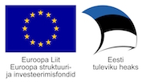

[EN](#EN)

### Dokumendivahetusprotokoll DHX / Document exchange protocol DHX

  

|     | DHX on uus, X-tee v6 omadustele rajatud dokumendivahetusprotokoll, mis võimaldab Eesti avaliku sektori dokumendihaldussüsteemidel vahetada dokumente hajus- e detsentraliseeritud põhimõttel. |
|-----|-------------|
|  | __[Protokoll](https://e-gov.github.io/DHX)__ _kinnitatud, ametlik tekst_ |
|  | [DHX Adapter](https://github.com/e-gov/DHX-adapter) _tarkvarakomponendid DHX-i rakendajatele_   -  sh tarkvarateegid |
|  | [Etalonteostus](https://github.com/e-gov/DHX-etalon) |
|  | Üleminekukava _tuleb_ |
|  | Rakendamise koordineerimine _tuleb_ ; teave: Eneli Järve https://github.com/EneliJarve, Riigi Infosüsteemi Amet, 663 0278, eneli.jarve@ria.ee |
|  | DHX aadressiraamat _tuleb_ - [DHX aadressiraamat](docs/DHX-aadressiraamat.md) | _spetsifikatsioon_ |
|  | Sertifitseerimine _protokolli rakendajate sertifitseerimist ei ole kavandatud_ |
|  | Testimisteenus _tuleb_ |
|  | Testide komplekt _tuleb_ |

Protokolli saab kasutada [MIT litsentsi alusel](LICENCE.txt).

### Protokolli arendamine
- [Foorum](https://github.com/e-gov/DHX/issues)
- [Osale arenduses](CONTRIBUTING.md)
- [Analüüs](https://github.com/e-gov/DHX/blob/master/files/Hajusa_dokumendivahetuse_andmevahetusprotokolli_DHX_anal%C3%BC%C3%BCs_1.2.pdf)
- Ettepanekud
  - 01 [Asünkroonne kättesaamiskinnitus](files/Ettepanek-01.md#as%C3%BCnkroonne-k%C3%A4ttesaamiskinnitus) TAGASI LÜKATUD
  - 02 [Mitut DHS-i toetav nimemuster](files/Ettepanek-02.md#mitut-dhs-i-toetav-nimemuster) SISSE VIIDUD v 1.0
  - 03 [Mitme aadressi käsitlus](files/Ettepanek-03.md) SISSE VIIDUD v 1.0.1
  - 04 [Mitme alamsüsteemi kasutamine](files/Ettepanek-04.md) SISSE VIIDUD v 1.0.2
  - 05 [Teenuse sendDocument spetsifikatsiooni täiendamine mittekohustusliku väljaga recipientSystem](files/Ettepanek-05.md) SISSE VIIDUD v 1.0.2
  - 06 [Muuta teenuse representationList laiendatavaks, sarnaselt teenusega sendDocument](files/Ettepanek-06.md) SISSE VIIDUD v 1.0.2
  - 07 [Parameetrite lisamine teenusesse representationList](files/Ettepanek-07.md) SISSE VIIDUD v 1.0.3
- [Vormingutevahelised seosed](https://e-gov.github.io/DHX/Vormingud.html)
- [E-arved DVK-s üleminekuperioodil](docs/E-arved.md) _töödokument_
- [Esitlus](http://slides.com/priitparmakson/dhx/fullscreen)

#### Taustamaterjale
- [Kirjandus](files/Kirjandus.md)
- [Dokumendihalduse "ökosüsteem"](files/DOK-S.md)

#### Projekt "Dokumendivahetustaristu hajusarhitektuurile üleviimise väljatöötamine"

mai 2016 - veebruar 2017

Projektis: 

- täpsustatakse, detailiseeritakse ja verifitseeritakse (sh sihtrühmadega) projekti ettevalmistamisel loodud kontseptsioon;
- töötatakse välja andmevahetusprotokoll, lähtudes projekti ettevalmistamise tulemusel valminud kavandist;
- luuakse demonstraator (_proof of concept_, töötav mudel) protokolli headuse tõestamiseks
- arendatakse välja universaalne tarkvarakomponent
- tehakse vajalikud muudatused dokumendivahetuskeskuses
- valmistatakse ette uuele andmevahetusprotokollile üleminek:
     - koostatakse üleminekukava (sh vajadusel õiguslikud muudatused)
     - korraldatakse asutustele suunatud teavitustegevusi.

Projekt tagab ettevalmistused riigile tehnoloogiliselt, organisatoorselt optimaalse ja kõige jätkusuutlikuma IT-arhitektuurseks ülesehituseks. Tulevikus paraneb tänus sellele asutuste dokumendivahetuse käideldavus, tõuseb turvalisus (konfidentsiaalsus), üldine tõrkekindlus ning kaob sõltuvus kesksest komponendist.

Projekti hankija on Riigi Infosüsteemi Amet ja täitja BPW Consulting OÜ. Projekti rahastatakse Euroopa Liidu struktuurifondide toetusega.

Projektijuht: Eneli Järve https://github.com/EneliJarve, Riigi Infosüsteemi Amet, 663 0278, eneli.jarve@ria.ee

_Lahtiütlus. Käesoleva repositooriumi sisu - kui ei ole öeldud teisiti - on arenduses olevad töödokumendid, mis ei ole kinnitatud ega ametlikult publitseeritud. Dokumentatsioon võib täieneda._

#### EN

- __[Protocol Text](docs/EN.html)__
- [Overview](https://github.com/e-gov/DHX/blob/master/files/Overview.md)
- [Presentation](https://github.com/e-gov/DHX/blob/master/files/DHX_EN%20%282%29.pdf) (with a very brief discussion of X-Road)
- [Discussion page](https://github.com/e-gov/DHX/issues)
- [How to contribute](https://github.com/e-gov/DHX/blob/master/CONTRIBUTING.md)
- [Reference implementation](https://github.com/e-gov/DHX-etalon)

Protocol is published with [MIT licence](LICENCE.txt).
