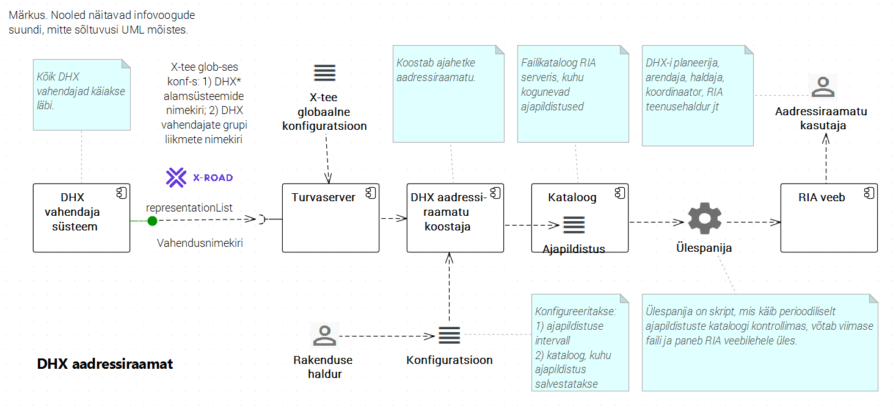

# DHX aadressiraamat

Spetsifikatsioon

v0.2 01.11.2016

Sisukord

- [1 Ülevaade](#1-Ülevaade)
- [2 Mõisted ja lühendid](#2-mõisted-ja-lühendid)
- [3 Vajadus](#3-vajadus)
- [4 Lahendus](#4-lahendus)
- [5 Ei ole skoobis](#5-ei-ole-skoobis)
- [6 Teostus](#6-teostus)
- [Viited](#viited)
- [Muutelugu](#muutelugu)

## 1 Ülevaade

__DHX aadressiraamat__ on tööriist, mille abil hajusale dokumendihaldusele ülemineku erinevad osapooled saavad ülevaate sellest, kes ja kuidas on DHX-i võimekuse loonud ning kes pakuvad DHX vahendusteenust.

## 2 Mõisted ja lühendid

Spetsifikatsioonis kasutatakse [Dokumendivahetusprotokolli DHX mõisteid ja lühendeid](https://e-gov.github.io/DHX/#3-m%C3%B5isted-ja-l%C3%BChendid).

| mõiste | seletus |
|--------|---------|
| _ajapildistus_ | mingil ajamomendil koostatud DHX aadressiraamat. Ajapildistus salvestatakse faili masintöödeldavas vormingus (JSON) ja teisendatakse enne RIA veebilehel avaldamist HTML-i. |
| _DHX aadressiraamat_, _DHX AR_ | konkreetse ajamomendiga seotud nimekiri, mis näitab ajamomendil: 1) DHX-i võimekust omanud asutusi; 2) DHX-i vahendajaid ja nende kliente. Asutused ja ettevõtted esitatakse nimekirjas registrikoodide ja nimetuste kaudu, sorteeritult. |

## 3 Vajadus

1. Avaliku sektori üleminek hajusale dokumendivahetusele algab plaanide kohaselt 2017. a. Erinevad sihtrühmad (asutused, arendajad, teenusepakkujad, ITAO) hakkavad RIA poole pöörduma küsimustega:
  1. kes on DHX-i vahendajad?
  2. millised asutused on DHX-i vahendajate kliendid?
  3. kes asutustest on DHX-ile juba üle läinud?
2. Vajame jooksvat ülevaadet ülemineku seisust.
3. Vajalik teave sisaldub mitmes allikas:
  1. X-tee globaalses konfiguratsioonis
    1. DHX nimemustriga (DHX*) alamsüsteemide andmetes
    2. DHX vahendajate grupi liikmete nimekirjas
  2. DHX-i vahendajate poolt X-teel publitseeritavates vahendusnimekirjades.
4. Puudub lihtne viis selle teave kiireks kokkusaamiseks ja inimesele esitamiseks.

## 4 Lahendus

4.1 Arhitektuurijoonis

Joonis 1

4.2 __Komponendid__ Tööriist koosneb järgmistest komponentidest:
  - _DHX aadressiraamatu koostaja_, lühidalt _Koostaja_ - Java rakendus, mis koostab ajahetke aadressiraamatu ja salvestab selle failina kataloogi.
  - _Kataloog_ - failikataloog, kuhu kogunevad ajapildistused.
  - _Ülespanija_ - skript, mis käib perioodiliselt ajapildistuste kataloogi kontrollimas, võtab kõige uuema faili, teeb selle inimoetavaks (JSON -> HTML teisendus) ja paneb RIA veebilehele üles.
  - _RIA veeb_ - DHX aadressiraamat publitseeritakse inimloetaval kujul (HTML) RIA veebi asjakohases sektsioonis.  

4.3 __Töövoog__ Tööriist peab realiseerima protsessi:
   - pöördumine
      - X-tee globaalse konfiguratsiooni
      - ja X-teel publitseeritavate DHX-i vahendusnimekirjade poole,
   - sealt teabe kogumine ülalnimetatud kolmele küsimusele vastamiseks
   - teabe esitaks veebiliidese kaudu inimkasutajale.

4.4 __Kasutajad__
  - Teenus on suunatud inimkasutajatele: DHX-i planeerijale, arendajale, haldajale, dokumendihalduse koordinaatorile jt.
  - Kasutajad võivad olla nii RIA-sisesed kui ka välised.
  - Tööriista põhikasutajaks kujunevad eeldatavalt RIA teenusehaldurid ja ülemineku koordinaator, kes kasutavad teavet erinevate sihtrühmade nõustamiseks, probleemide lahendamiseks, üleminekuprotsessi seireks ja statistika andmiseks dokumendihaldust koordineerivale üksusele ITAO-le.
  
4.5 __Konfigureerimine__ Komponendis Koostaja peab olema konfigureeritav:
  - ajapildistuse intervall
  - kataloog, kuhu ajapildistus salvestatakse.

## 5 Ei ole skoobis

5.1 __DHX-i „aadressiraamatut“ ei pakuta masinloetavalt.__
  - DHX-i rakendav infosüsteem peab, DHX protokolli kohaselt, dokumendiedastuseks vajaliku aadressiotsingu teostama lokaalselt (https://e-gov.github.io/DHX/#74-lokaalne-aadressiraamat).
  - Samas on tööriist projekteeritud nii, et vajadusel saab masintöödeldavat väljundit (JSON) väikese täiendusega kasutada.

5.2 __RIHA andmete kasutamine.__ Tööriist esimeses teostuses ei haara RIHAs registreeritavat teavet. RIHAst pakuks huvi see, kuidas asutused märgivad end dokumendihalduse standardlahenduste kasutajateks ja DHX-i vahendajaid oma DHS-de volitatud töötlejateks. Nimetatud protsess ei ole veel põhjalikult läbi analüüsitud. Samuti puudub RIHA-l praegu võime nimetatud andmeid masinloetaval kujul välja anda. Tööriista täiendamine RIHA andmete hõivamisega on võimalik tulevikus.

5.3 __laiapõhjalisem DHX dokumendiliikluse, sh DHX vahendamise monitooring ja statistika__ Tööriist on mõeldud kitsa (aga olulise) teabevajaduse rahuldamiseks. Laiema ja sügavama monitooringu ning statistika tegemiseks võivad olla kasulikud X-tee monitooringulahendus vm vahendid.  

## 6 Teostus

6.1 __Infoturve__ (_Märkus. Käesolev punkt on esialgne ja vajab täpsustamist._)
  - Käideldavusnõue on madal. Ei ole hullu, kui teenus päeva maas peaks olema.
  - Tervikluse nõue. DHX aadressiraamat on mõneti sarnane usaldusnimekirjaga (_Trusted Service List_), kuid aadressiraamatu andmed on siiski vaid informatiivsed. Andmed võetakse autentsetest allikatest ega läbi inimtöötlust. Kataloog peab olema kaitstud autoriseerimata muutmise eest. 
  - Konfidentsiaalsuse nõue on madal: RIA veebis publitseeritav DHX aadressiraamat on avalikult, ilma kasutajat autentimata kättesaadav.  
  - ISKE turbeaste - M (madal).

6.2 __Olemasolevate komponentide kasutamine__ Tööriista programmeerimiseks vajalikud tarkvarakomponendid on suures osas DHX etalonteostuse käigus juba loodud. Vt [DHX adapter](https://github.com/e-gov/DHX-adapter).

6.3. __Arendustöö maht ja keerukus__ Hinnanguliselt väike.

## Viited

- [Dokumendivahetusprotokoll DHX](https://e-gov.github.io/DHX/)

## Muutelugu

| versioon, kuupäev | muudatus |
|-------------------|----------|
| v0.1 28.10.2016   | algversioon, vt https://github.com/e-gov/DHX/issues/41 |
| v0.2 01.11.2016   | detailiseering |

