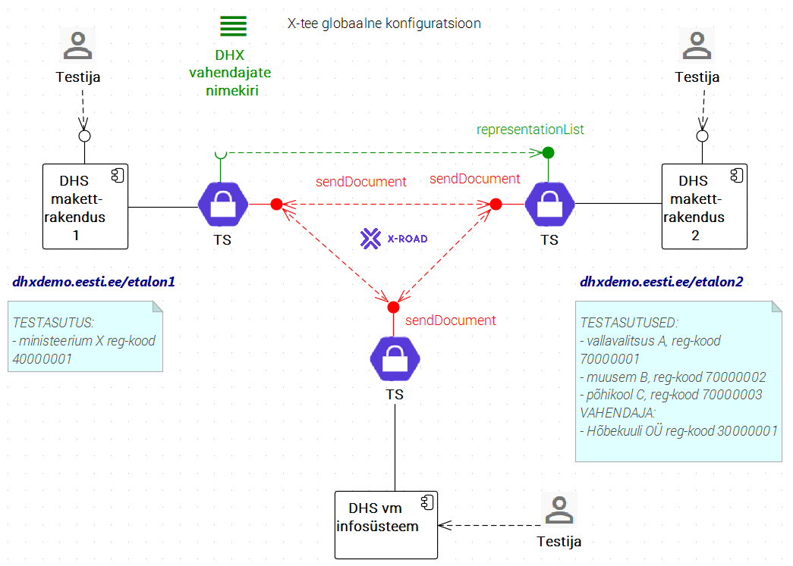

# DHX standardtestid

v0.1 09.11.2016

## 1 Ülevaade

Esitatakse standardne testide komplekt DHX-i võimekuse testimiseks ja näidatakse, kuidas DHX etalonteostust kasutada testimiseks.

Dokument on suunatud DHX-i võimekuse loomisele suunatud arendustööde kavandajatele, arendajatele ja testijatele.

## 2 Mõisted ja lühendid

Lisaks alljärgnevateke kasutatakse käesolevas dokumendis [dokumendivahetusprotokolli DHX mõisteid ja lühendeid](https://e-gov.github.io/DHX/#3-m%C3%B5isted-ja-l%C3%BChendid).

| mõiste | seletus |
|--------|---------|
| _etalonrakendus_ | etalonteostuse käigus loodud, RIA taristus käitatav rakendus, mis etendab DHX-i võimekusega infosüsteemi ja mida saab kasutada DHX-i võimekuse testimiseks. |
| _etalonteostus_ | Kahest eraldi paigaldatud, RIA taristus käitatavast rakendusest (_etalonrakendusest_) koosnev vahend, mida saab kasutada testitava süsteemi testimiseks; vt [DHX-i etalonteostus](https://github.com/e-gov/DHX-etalon). |
| _testitav süsteem_ | X-teega liidestatud infosüsteem - dokumendihaldussüsteem (DHS) või ka muu süsteem - mille DHX-i võimekust testitakse. |
| _DHX standardtest_ | DHX võimekuse testimiseks üldjuhul hädavajalik, praktiliselt teostatav test. | 
| _test_ | Käesolevas dokumendis kasutatakse testiloo tähenduses. |

## 3 Etalonteostuse kasutamine DHX-i testimiseks

DHX-i võimekuse loonud süsteemi testimiseks võib kasutada [DHX-i etalonteostust](https://github.com/e-gov/DHX-etalon).
- Etalonteostus koosneb kahest eraldi paigaldatud, RIA taristus käitatavast rakendusest, mis etendavad DHX-i võimekusega infosüsteeme.
  - Etalon1, [https://dhxdemo.eesti.ee/etalon1/](https://dhxdemo.eesti.ee/etalon1/), etendab DHX-i otsevõimekusega asutust
  - Etalon2, [https://dhxdemo.eesti.ee/etalon2/](https://dhxdemo.eesti.ee/etalon2/), etendab DHX-i vahendajat, kes vahendab kolme asutust.
- Etalonteostus töötab X-tee arenduskeskkonnas.

## 4 Testiplaan

- Eeldused
  - luua testitavas DHS-i (vm infosüsteemis) DHX-i võimekus (teenuse `sendDocument` osutamise ja tarbimise võimekus; lokaalse aadressiraamatu koostamise võimekus; vahendaja korral - teenuse `representationList` osutamise võimekus)
  - registreerida DHX alamsüsteem X-tee arenduskeskkonnas

- __TEST 1a: Süsteemi ilmumine aadressiraamatusse__
  - etalonrakenduse abil kontrollida testitava süsteemi ilmumist lokaalsesse aadressiraamatusse
- __TEST 1b: Lokaalse aadressiraamatu koostamise õigsus__
  - eelduseks on nõude testimise eesmärgil testitavasse süsteemi sisse ehitatud vastav logimine; logi võrreldakse etalonrakenduses koostatud aadressiraamatuga; aadressiraamatud peavad ühtima. Kontrollitav nõue: [7.4 Lokaalne aadressiraamat](https://e-gov.github.io/DHX/#74-lokaalne-aadressiraamat)  
  - Märkus. Kasutada võib ka [DHX aadressiraamatu](DHX-aadressiraamat.md) teenust

- __TEST 2a: Dokumendi saatmine (õige dokument, DHX otsevõimekusega asutusele)__
  - 1) testitavast süsteemist saata dokument etalonrakendusse 1 (testasutusele Ministeerium); 2) etalonrakenduse logist kontrollida dokumendi kohalejõudmist
    - 1) testitav süsteem saadab nõuetekohaselt kapseldatud dokumendi etalonrakendusele; 2) etalonrakenduse kasutajaliidese kaudu kontrollitakse, et dokument on õigesti kohale jõudnud. Kontrollitav nõue: [5.6 Kapsli kasutamine](https://e-gov.github.io/DHX/#56-kapsli-kasutamine)
- __TEST 2b: Dokumendi saatmine (õige dokument, vahendajat kasutavale asutusele)__
  - testitavast süsteemist saata dokument etalonrakendusse 2 (testasutusele Vallavalitsus, Muuseum, Põhikool); 2) etalonrakenduse logist kontrollida dokumendi kohalejõudmist
- __TEST 2c: Dokumendi korduv saatmine__
  -1) testitav süsteem saadab seeria dokumente etalonrakendusele; 2) etalonrakenduse kasutajaliidese kaudu kontrollitakse, et saadetise id-d on erinevad. Kontrollitav nõue: [5.7 Unikaalne identifikaator.](https://e-gov.github.io/DHX/#57-unikaalne-identifikaator)
- __TEST 2d: Saatmine suvalisele DHX-i võimekusega asutusele__
  - 1) etalonrakenduse kasutajaliideses kuvatavast DHX aadressinimistust võetakse juhuslikult asutus; 2) kontrollitakse, kas testitav süsteem suudab asutusele dokumenti saata. Kontrollitav nõue: [7.1 Addressaadi DHX-i võimekuse väljaselgitamine](https://e-gov.github.io/DHX/#71-dhx-v%C3%B5imekus)

- __TEST 3a: Vastuvõtmine (õige dokument)__
  - 1) etalonteostuse kasutajaliidese abil saata testitavale süsteemile õigesti moodustatud ja adresseeritud dokument; 2) kontrollida etalonteostuse kasutajaliidese kaudu, et testitav süsteem vastab nõuetekohase 'OK teatega; 3) testitavast süsteemist kontrollida, et dokument on kohale jõudnud.
- __TEST 3a: Vastuvõtmine (valesti adresseeritud dokument)__
  - 1) etalonteostuse kasutajaliidese abil saata testitavale süsteemile valesti adresseeritud dokument; 2) kontrollida etalonteostuse kasutajaliidese kaudu, et testitav süsteem vastab nõuetekohase veateatega; 3) testitavast süsteemist kontrollida, et vigane transaktsioon logitakse asjakohaselt. Kontrollitav nõue: [8.1 Aadressi kontroll](https://e-gov.github.io/DHX/#81-aadressi-kontroll)
- __TEST 3b: Vastuvõtmine (valesti kapseldatud dokument)__
  - 1) etalonteostuse kasutajaliidese abil saata testitavale süsteemile valesti kapseldatud dokument; 2) kontrollida etalonteostuse kasutajaliidese kaudu, et testitav süsteem vastab nõuetekohase veateatega; 3) testitavast süsteemist kontrollida, et vigane transaktsioon logitakse asjakohaselt. Kontrollitav nõue: [8.3 Kapsli kontroll](https://e-gov.github.io/DHX/#83-kapsli-kontroll)  
  
Märkus. Ülalolev testiplaan hõlmab ka DVK-ga suhtlemist, sest DVK tegutseb üleminekuperioodil DHX-le veel üle minemata asutuste vahendajana.

## Viited

- [Dokumendivahetusprotokoll DHX](https://e-gov.github.io/DHX/)

## Muutelugu

| versioon, kuupäev | muudatus |
|-------------------|----------|
| v0.2 14.11.2016   | lisatud joonis ja testiplaan |
| v0.1 09.11.2016   | algversioon |
