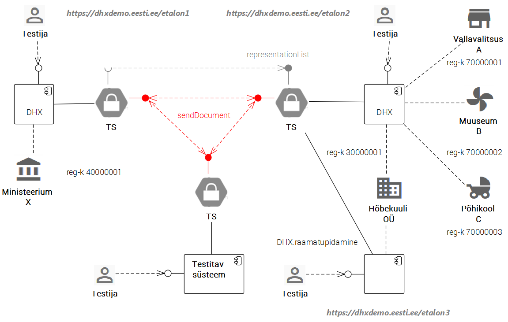

# DHX-ga tutvumine ja testimine

__Öelge palun, kas teie kasutate DHX-i?__ Jah, oleme hajusale dokumendivahetusele üle läinud. Rakendame DHX-i ministeeriumi dokumendihaldussüsteemis.

__Kuidas saab teile dokumente saata?__ Lihtne küsimus. Meie DHS-i nimi X-teel on, nii nagu DHX standard ette näeb, `DHX`. Sellele tuleb ette panna ministeeriumi registrikood `40000001`. X-tee täisnimi seega on `EE-DEV/GOV/40000001/DHX`.

__Hõbekuuli OÜ? Öelge, palun, millega teie firma tegeleb?__ Heameelega. Oleme eesti kapitalil põhinev firma. Põhiliselt pakume IT süsteemide majutusteenust. Muuhulgas tegeleme ka DHX-i vahendamisega.

__Palun, kas avaksite lähemalt, mida DHX-i vahendamine tähendab?__ Aga palun. Vahendamist pakume asutustele ja ettevõtetele, kes soovivad X-teel DHX-i dokumendivahetuses osaleda, kuid ei oma selleks vajalikku infrastruktuuri või ei taha infra ülalpidamisega tegelda. Peamiselt väiksemad asutused. Näiteks vallavalitsus A, muuseum B ja põhikool C, kui nimetada mõnd meie klienti. Tavaliselt on ka kliendi DHS meie juures majutatud, aga ei pea tingimata olema.

__Ja kas olete äriga rahul?__ Kindlasti. Kliendid on rahul ja kasvuvõimalused on head. Olen isegi Hõbekuuli raamatupidamise ühendanud DHX-iga. Kui ministeerium tahab saata meile arve, siis ta teeb seda DHX-ga. Arve läheb kohe meie raamatupidamissüsteemi. Eat your own dogfood, nagu IT-mehed ütlevad.

__Kuidas teie süsteemidega suhelda saab?__ DHX-is on see lihtne. Adresseerimiseks on vaja teada ainult asutuse või ettevõtte registrikoodi. Näiteks vallavalitsusel A on registrikood `70000001`, muuseumil B - `70000002`, põhikoolil C - `700000003`. Teie süsteem leiab X-tee globaalsest konfiguratsioonist, et Hõbekuul on `70000001`, `70000002` ja `70000003` vahendaja. Järelikult võtate Hõbekuuli registrikoodi ja saadate X-teel `EE-DEV/COM/30000001/DHX`. Dokumendi kapslis märgite kellele ma pean dokumendi edastama (`70000001`, `70000002` ja `70000003`). Kui soovite Hõbekuuli raamatupidamisse saata, siis panete `EE-DEV/COM/30000001/DHX.raamatupidamine`.

__Selge. Aga kuidas kontrollida, et saadetud dokumendid tõesti kohale jõudsid?__ Väga lihtne. Annan teile juurdepääsu meie vahendussüsteemi ja raamatupidamise kasutusliidestele. Võtke veebisirvijas lahti `https://dhx.demo.eesti.ee/etalon2` ja teises aknas `https://dhx.demo.eesti.ee/etalon3`. Seal saate vaadata, kellelt mis dokumendid on saabunud. Saate ka ise dokumente saata. Ministeeriumi DHS-il on samasugune kasutajaliides - `https://dhx.demo.eesti.ee/etalon3`.

__Kui ma tahan ka DHX-ga liituda, kuidas ma saan oma süsteemi testida?__ Liituge X-tee arenduskeskkonnaga, arendage oma süsteemis välja X-tee võimekus, valige oma süsteemile DHX alamsüsteemi nimi (DHX või DHX*). Pange oma süsteem ministeeriumile, aga samuti vallavalitsusele A, muuseumile B ja põhikoolile C dokumente saatma. Saatke dokumente ka Hõbekuuli OÜ raamatupidamisele. Nii testitegi.

