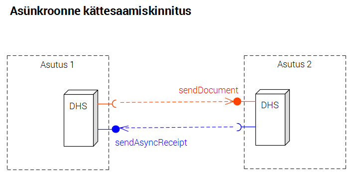

DHX protokolli täiendamise ettepanek 01

Vt ka https://github.com/e-gov/DHX/issues/38 "Kättesaamise semantika".

Täiendada DHX protokolli järgmiselt:

//////////////////////////////////////////////////

#### 7.6 Kättesaamiskinnitus
__Vastuvõttev süsteem PEAB saatma kinnituse dokumendi kättesaamise kohta .__

DHX-i ärinõude - dokumendi garanteeritud kohaletoimetamise - tagamiseks peab dokumendi saaja saatma kinnituse dokumendi kättesaamise kohta. 

__Kättesaamiskinnituse PEAB saatma kas sünkroonse või asünkroonse meetodiga.__

__Sünkroonse meetodi kasutamisel saadetakse kättesaamiskinnitus teenuse `sendDocument` päring-vastus (request-response) sõnumipaari vastussõnumis.__

Dokumentide edastamine DHX-is tugineb X-tee standardsele "sünkroonsele" päring-vastus (_request-response_) sõnumimustrile. "Sünkroonsus" tähendab seda, et sõnumit saatvad ja vastuvõtvad turvaserverid on seadistatud vastust ootama suhteliselt lühikese aja jooksul (tavaliselt 2..5 minutit). Kui vastus selle aja jooksul ei tule, loetakse edastusüritus ebaõnnestunuks. See tähendab, et vastuvõttev süsteem saab kinnituse dokumendi kättesaamise kohta saata ainult automatiseeritult (masina poolt). Nii on ka tehtud: kättesaamiskinnitus saadetakse teenuse `sendDocument` vastussõnumis (_response message_) Hinnanguliselt katab see lahendus valdava osa DHX-i kasutajate vajaduse.

Siiski võib olla süsteeme, mis vajavad kättesaamiskinnituse koostamiseks rohkem aega. Kui kättesaamise osaks loetakse ka dokumendi hõlmamist vm tegevusi, mis nõuavad inimese sekkumist või pöördumist kolmanda andmetöötlusseadme või -süsteemi poole (dokumendi edastamine vahendaja poolt lõppadressaadile), siis võib X-tee standardne "sünkroonse" sõnumimustri rakendamine olla raskendatud või isegi võimatu.

__Asünkroonse meetodi kasutamisel PEAB Vastuvõttev süsteem teenuse `sendDocument` vastussõnumis teatama, et saadab kättesaamiskinnituse asünkroonselt.__
__Teate vorming on määratletud protokolli lisas 1 olevas teenuse `sendDocument` spetsifikatsioonis.__

__Vastuvõttev süsteem saadab asünkroonne kättesaamiskinnituse saatva süsteemi teenuse `sendAsyncReceipt` poole pöördumisega.__

__DHX-i rakendav asutus (või tema DHS vahendusteenuse või DHS majutusteenuse pakkuja) PEAB arendama oma DHS-is välja asünkroonse kättesaamiskinnituse teenuse ja käitama seda.__

__DHX-i rakendaja teostatud asünkroonse kättesaamiskinnituse teenus PEAB vastama lisas 3 esitatud täpsemale spetsifikatsioonile.__

----

Märkus. DHX ei võta seisukohta kättesaamise semantika osas (nt kas kättesaamine eeldab ka dokumendi hõlmamist või mitte), vaid lähtub selle sõna üldlevinud tähendusest. 

Märkus. Kättesaamiskinnituse edastamine sünkroonselt (teenuse `sendDocument` vastussõnumis) ja asünkroonselt (teenuse `sendAsyncReceipt` päringsõnumis) on tehnilises mõttes võrdselt turvalised ja pakuvad võrdse jõuga garantiid. Küsimus on ainult sünkroonsuses-asünkroonsuses.  Ei saa väita üldistatul kumb on parem - (sünkroonne või asünkroonne. Küsimus on kumb on sobivam - vastus sõltub konkreetse süsteemi võimekusest.

//////////////////////////////////////////////////

HINNANG

1. __Äriline vajadus__ (kas sellist omadust on vaja?) Praeguse teave vajaduse kohta on mittetäielik ja osalt vastukäiv (kas dokumendi registreerimisnumbri tagastamist on vaja või mitte. Kättesaamiskinnituse asünkroonne edastamine oleks tõenäoliselt vajalik vahendajate puhul, kes ei majuta klientide DHSe, vaid on ühenduslüliks X-tee ja kliendi DHSi vahel. Ei ole teada kas ja kui palju selliseid juhte võiks olla. Kas vahendaja võib kinnituse kättesaamise kohta edastada kohe, kui dokument temani jõuab (ja hoolt kandma dokumendi adressaadile kohaletoimetamise eest) või peab ta dokumendi enne tingimata adressaadi süsteemi edastama? Lihtsam oleks piirduda esimese variandiga; see eeldab muidugi usaldusväärset vahendajat.
2. __Tasakaalustatus__ Peab arvestama, et `sendAsyncReceipt` teenuse ja sellega seonduva loogika teostamine on kulu igale saatjale.
3. __Lahenduse tehniline kvaliteet__. Hea oleks hinnata X-teel kasutatavate analoogiliste asünkroonsete kinnitusmehhanismide praktikaga võrdluses.

