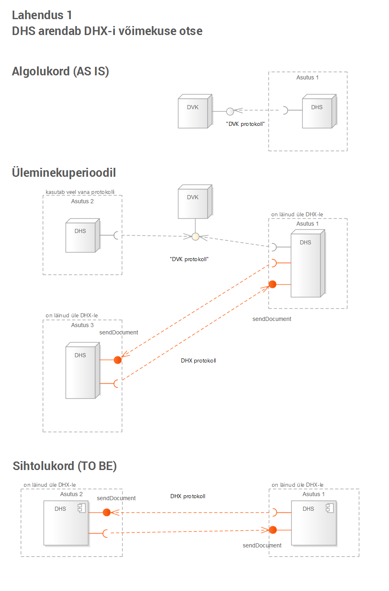

# Ülemineku variandid

DHX protokollile ülemineku tehnilisi lahendusvariante on kaalumisel kolm. 

1 &nbsp; DHS arendab DHX-i võimekuse iseseisvalt, ilma RIA poolt arendatava tarkvarakomponendita. Üleminekuperioodil peab DHS üheaegselt toetama nii DVK kui ka DHX protokolli.

Märkus. DHX-võimekus tähendab `sendDocument` teenuse pakkumist ja võimet kasutada teise asutuse `sendDocument` teenust.

2 &nbsp; DHS paigaldab RIA poolt arendatud universaalse tarkvarakomponendi – „DHX teisendaja“.

3 &nbsp; Üleminekuperioodil kasutatakse RIA poolt DVK juurde arendatud DHX lüüsi; see lihtsustab  DHS-des vajalikke arendusi.

